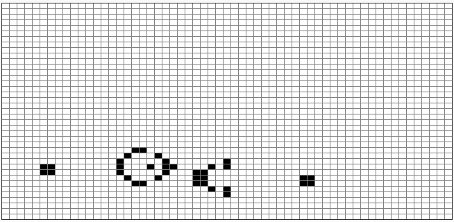

# Exercice 2 - La fourmi de langton, v2 : 96 étapes, grille de 15 x 15 (centrée en 7,7), cases de 25 pixels de côtés, une étape dure 0.1s, fourmi initialement tête à gauche

Tout est dans le titre, pour réaliser cette animation : https://youtu.be/qZRYGxF6D3w?t=118

Note importante, pour l'exercice précédent, on a suivi la première animation (non programmée) de David Louapre en plaçant la fourmi tête vers le haut. Mais pour sa simulation informatique (dans laquelle la fourmi devient une flèche), David a commencé son animation avec une fourmi tête à gauche. Il faudra donc (pour cette version 2 du programme) positionner notre fourmi tête à gauche avant de démarrer la première étape, afin d'obtenir les mêmes résultats (dans le même sens) que ceux de la vidéo.

On doit donc ici modifier légèrement l'exercice précédent (fourmi v1) pour obtenir (après 96 itérations) le résultat suivant :

@[Exercice 2]({"stubs": ["main.c"],"command": "sh /project/target/run.sh", "project" : "fourmi2"})
