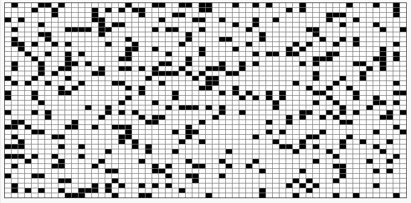

# Exercice 3 - La fourmi de langton, v3 : 472 étapes, grille de 15 x 15 (centrée en 7,7), cases de 25 pixels de côtés, une étape dure 0.025s, fourmi initialement tête à gauche

Tout est dans le titre, pour réaliser cette animation : https://youtu.be/qZRYGxF6D3w?t=143

Avec pour résultat final au bout des 472 cases parcourues par la fourmi :

@[Exercice 3]({"stubs": ["main.c"],"command": "sh /project/target/run.sh", "project" : "fourmi3"})
