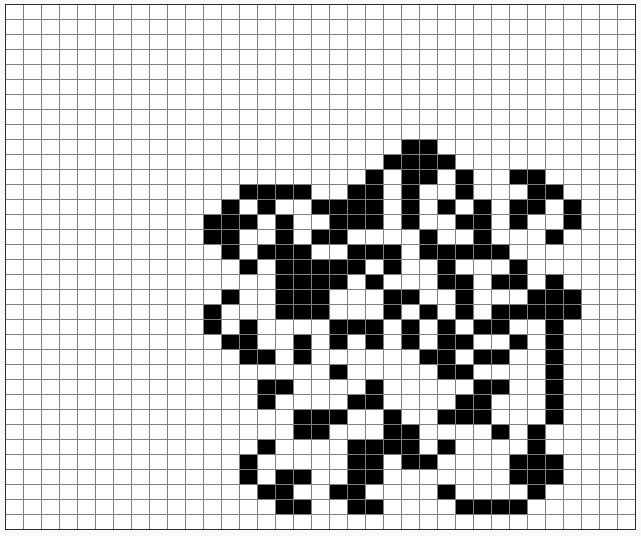

# Exercice 4 - La fourmi de langton, v4 : 2000 étapes, grille de 35 x 35 (centrée en 17,17), cases de 15 pixels de côtés, une étape dure 0.01s, fourmi initialement tête à droite

Tout est dans le titre, pour réaliser cette animation : https://youtu.be/qZRYGxF6D3w?t=196

Mais ce coup-ci, la capricieuse fourmi de David était tournée tête à droite avant de démarrer...

Avec pour résultat final au bout des 2000 cases parcourues par la fourmi :

@[Exercice 4]({"stubs": ["main.c"],"command": "sh /project/target/run.sh", "project" : "fourmi4"})
