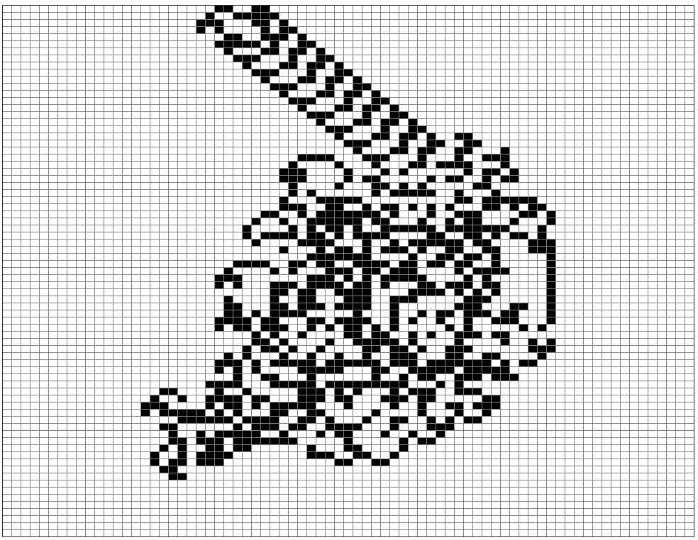

# Exercice 5 - La fourmi de langton, v5 : 11000 étapes, grille de 75 x 75 (centrée en 37,37), cases de 10 pixels de côtés, une étape dure 0.0025s, fourmi initialement tête à droite

Tout est dans le titre, pour réaliser cette animation : https://youtu.be/qZRYGxF6D3w?t=247

Avec pour résultat final au bout des 11000 déplacements de la fourmi, la mise en évidence de "l'autoroute" :

@[Exercice 5]({"stubs": ["main.c"],"command": "sh /project/target/run.sh", "project" : "fourmi5"})
